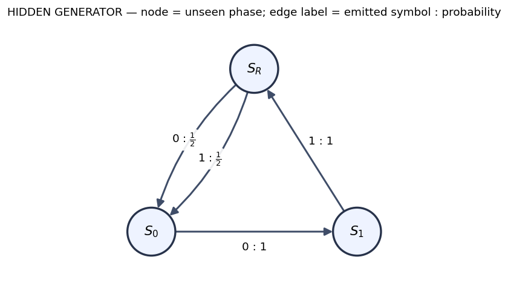

## What must an observer infer?

Zero–One–Random

The stream has a three-step rhythm. The phase is hidden.

  011
  010
  011
  …

<h3>Generator's problem</h3>

Which hidden phase emits next, and where does it move?

<h3>Observer's problem</h3>

Given only the symbols so far, what uncertainty should I retain?

A small generator does not imply a trivial prediction problem.

::: {.notes}
- Target: about 2 minutes.
- Read the blue `0,1` entries as deterministic phases and the orange entry as the fair-random phase.
- Ask the room what they would need to remember if the starting phase were unknown. Do not resolve the question yet.
:::

## How to read one edge

$$
S_i \xrightarrow{x:p} S_j
$$

means the <strong>joint event</strong>

$$
\Pr(X_{t+1}=x,\ S_{t+1}=S_j\mid S_t=S_i)=p.
$$

<strong>Timing convention:</strong> the state is the phase <em>before</em> the edge; traversing the edge emits a symbol and lands in the next phase.

::: {.notes}
- Target: about 2 minutes.
- Point to one edge and have a student read it aloud as a joint event.
- Stress that edge labels contain both an emitted symbol and a probability.
:::

## Generator state is not observer state

<h3>Hidden phase</h3>

One vertex of the generator diagram is physically occupied at each step.

This is part of a chosen realization of the process.

<h3>Observer belief</h3>
<svg class="empty-simplex" viewBox="0 0 440 355" role="img" aria-labelledby="simplex-title simplex-desc">
  <title id="simplex-title">Empty three-state probability simplex</title>
  <desc id="simplex-desc">A triangle whose vertices correspond to certainty in each of three hidden phases. No reachable beliefs are shown yet.</desc>
  <path d="M220 25 L35 325 L405 325 Z" fill="#f7f6fc" stroke="#6553a3" stroke-width="5"/>
  <circle cx="220" cy="225" r="10" fill="#6553a3"/>
  <text x="220" y="16" text-anchor="middle" font-size="24" fill="#18243d">certain Sᴿ</text>
  <text x="22" y="350" text-anchor="start" font-size="24" fill="#18243d">certain S₀</text>
  <text x="418" y="350" text-anchor="end" font-size="24" fill="#18243d">certain S₁</text>
  <text x="220" y="260" text-anchor="middle" font-size="22" fill="#6553a3">uncertain observer</text>
</svg>

The notebook will turn uncertainty into a state that moves when symbols arrive.

::: {.notes}
- Target: about 2 minutes.
- The dot is deliberately unlabelled: it previews a posterior without giving any reachable set away.
- Say “belief is relative to this chosen generator,” not “the hidden truth.”
:::

## Your derivation starts from the picture

  
diagram

→

  
symbol matrices

→

  
word probabilities

→

  
posterior update

→

  
future predictions

Open Notebook 1

<strong>First task:</strong> reconstruct the symbol-labelled matrices from the diagram before any matrix is revealed.

  
Which hidden paths can emit a given word?

  
How should the observer update after each new symbol?

  
Can three hidden phases generate more than three observer states?

::: {.notes}
- Target: 1–2 minutes, then hand off immediately.
- Do not derive the route on the slide; students own those steps.
- Remind students that supplied code cells draw and check, while their work is mathematical.
:::
