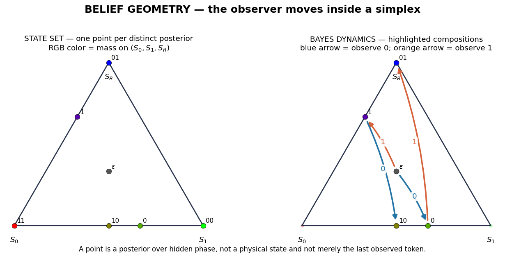
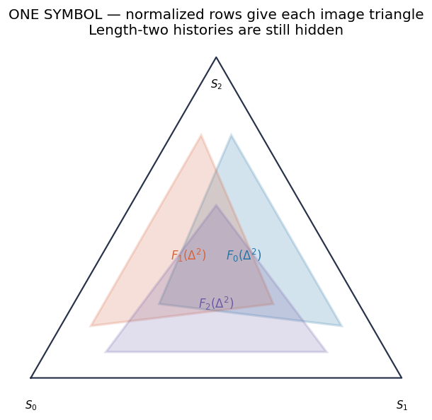
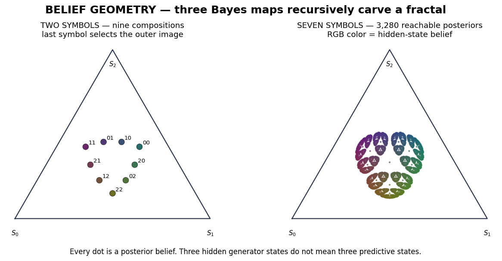
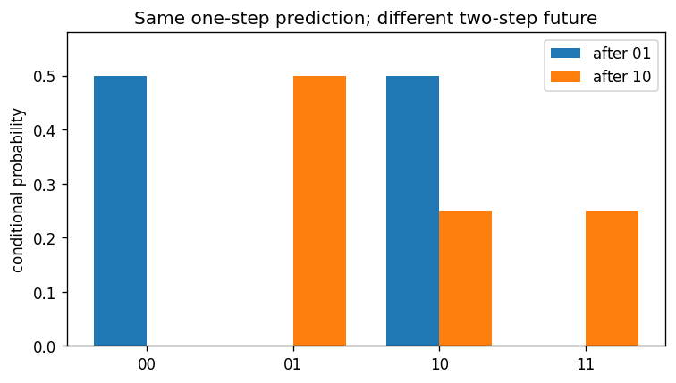

## What did you build?

  
HMM edges

→

  
$\Pr(w)$

→

  
$\eta^{(w)}$

→

  
$F_x$

→

  
belief geometry

→

  
future predictions

<h3>Linear propagation</h3>
Matrix products sum hidden paths.

<h3>Nonlinear step</h3>
Normalization depends on the current belief.

<h3>Change of view</h3>
Geometry is the same posteriors seen as points and maps.

::: {.notes}
- Target: about 90 seconds.
- Ask students to supply each arrow verbally before revealing your summary.
- Protect this synthesis even if the morning ran long: it is the dependency bridge to the afternoon.
:::

## Two machines answer two questions

<h3>Hidden Markov model</h3>

<strong>Question:</strong> how can a latent mechanism generate the observable stream?

<strong>State:</strong> hidden phase $S_t$.

<strong>Dynamics:</strong> symbol-labelled stochastic edges.

<h3>Mixed-state presentation</h3>

<strong>Question:</strong> how does an observer update uncertainty from the symbols?

<strong>State:</strong> reachable posterior $\eta^{(w)}$.

<strong>Dynamics:</strong> normalized maps $F_x$.

The MSP is an inference process induced by the generator—not another hidden physical machine.

::: {.notes}
- Target: about 90 seconds.
- Invite one student to state the difference without using the word “state” alone.
- Emphasize histories are labels for MSP states; equal posteriors are the same MSP point.
:::

## One normalization creates the observer dynamics

$$
\underbrace{\pi T^{(w)}}_{\text{unnormalized forward row}}
\quad\xrightarrow{\text{sum}}\quad
\Pr(w)=\pi T^{(w)}\mathbf 1
\quad\xrightarrow{\text{normalize}}\quad
\eta^{(w)}=\frac{\pi T^{(w)}}{\pi T^{(w)}\mathbf 1}.
$$

After a new symbol $x$ arrives, reuse the posterior as the next prior:

$$
F_x(\eta)=\frac{\eta T^{(x)}}{\eta T^{(x)}\mathbf 1}.
$$

<h3>Before normalization</h3>
Matrix propagation is linear.

<h3>After normalization</h3>
The denominator bends straight mixtures into nonlinear dynamics.

::: {.notes}
- Target: about 2 minutes.
- This is recap, not a fresh derivation. Ask what the denominator means: the probability of observing $x$ under the current belief.
- Keep row-vector orientation consistent with the notebooks.
:::

## Bayes becomes motion inside a simplex

Each point is a posterior over hidden phase. Each arrow is “observe one more symbol, then renormalize.”

::: {.notes}
- Target: about 2 minutes.
- On the left, histories are labels, not the state itself.
- On the right, trace one two-symbol path and have students name the two update maps composing it.
:::

## Stop: do the Mess3 calculation

Do not reveal the result yet

Return to the Mess3 synthesis in Notebook 1. Normalize the visible rows for each symbol and calculate at least one two-map composition—or complete that calculation together.

Where does each one-symbol Bayesian update send the hidden-state simplex?

::: {.notes}
- Budget 5–8 minutes here if the room reached CORE 4 without completing the Mess3 calculation.
- This is a genuine stop: there is no result figure on this slide.
- Advance only after students have supplied the normalized image vertices and worked through one composition.
:::

## One symbol selects an image of the simplex

  <strong>observe 0</strong> → $F_0(\Delta^2)$
  <strong>observe 1</strong> → $F_1(\Delta^2)$
  <strong>observe 2</strong> → $F_2(\Delta^2)$

::: {.notes}
- Target: about 90 seconds.
- Ask what determines each image triangle: the normalized rows of the corresponding symbol matrix.
- The slide-native key is the readable reference; the smaller labels inside the raster show the same three images.
:::

## Repeated Bayes maps carve predictive geometry

Three hidden generator states define the ambient triangle—not the number of reachable observer beliefs.

::: {.notes}
- Target: about 2 minutes.
- Left: composition nests images. Right: iteration reveals the limiting visual structure.
- Every dot is a posterior belief, not a physical hidden state and not a token embedding.
:::

## Same next token, different future

$$
\eta^{(01)}=(0,0,1),\qquad
\eta^{(10)}=(1/2,1/2,0).
$$

Both give

$$
\Pr(X_{t+1}=0,1\mid h)=(1/2,1/2),
$$

but disagree over two-token futures.

The current next-token vector is not generally sufficient as the <em>sole recursively retained state</em>.

::: {.notes}
- Target: about 2 minutes.
- State the quantifier carefully: this is a result about a sole recursive next-token state.
- Ask which two-token test most visibly separates the two histories.
:::

## What follows—and what does not

<h3>Established</h3>

A chosen HMM posterior is sufficient to predict every future word generated by that realization.

<h3>Qualified</h3>

Belief coordinates are model-relative and may contain redundant distinctions.

<h3>Not established</h3>

A full-prefix transformer need not persistently store this posterior; it can recompute or use other predictive coordinates.

Afternoon puzzle

If next-token training rewards future-sensitive computation, what trace—if any—should that leave in transformer activations?

::: {.notes}
- Target: 1–2 minutes plus questions.
- Use remaining time for unfinished exercises and questions; this slot is intentionally a buffer.
- The first claim is sufficiency relative to a chosen realization, not automatic minimality for the observable process.
:::
