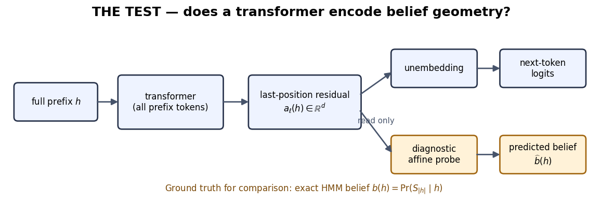

## The discovery puzzle

A transformer is trained only on next-token loss. Why look for anything richer than its next-token probabilities?

<h3>History `01`</h3>

Belief $(0,0,1)$

Next token $(1/2,1/2)$

<h3>History `10`</h3>

Belief $(1/2,1/2,0)$

Next token $(1/2,1/2)$

The objective scores one step at a time; good computation can still depend on distinctions that matter later.

::: {.notes}
- Target: about 2 minutes.
- Bring back the exact pair students just established.
- Ask where a full-prefix transformer could obtain the missing distinction: earlier tokens, cached activations, or another coordinate system.
:::

## Where can we look without changing the model?

A probe is an external diagnostic fitted after training—not part of the transformer's forward pass.

::: {.notes}
- Target: about 2 minutes.
- Define only the objects: prefix, last-position residual activation, unembedding, exact HMM belief, and diagnostic probe.
- Do not derive the fit or reveal the answer students will propose in CORE 2.
:::

## Climb an evidence ladder, not a picture gallery

  
1<strong>Fit:</strong> can a simple diagnostic recover belief coordinates?starting clue

  
2<strong>Generalize:</strong> does it work on held-out histories?structure

  
3<strong>Discriminate:</strong> does it beat simpler next-token or covariate explanations?specificity

  
4<strong>Intervene:</strong> does changing the decoded direction change computation as predicted?causal use

::: {.notes}
- Target: about 2 minutes.
- Ask students which rung a regression alone can reach.
- The notebook reaches strong observational evidence, not a direct causal test of Bayesian updating.
:::

## Predict the controls before seeing results

<h3>Held-out histories</h3>
Does one map extrapolate?

<h3>Shuffled pairing</h3>
Could high dimension fake the fit?

<h3>Training checkpoints</h3>
Does structure emerge with learning?

<h3>Simple baselines</h3>
Would token, length, or next-token probabilities suffice?

Provenance rule

Keep <strong>teaching simulation</strong>, <strong>reported paper result</strong>, and <strong>our inference</strong> visibly separate.

::: {.notes}
- Target: about 2 minutes.
- Do not answer the cards. Students predict what each comparison rules out in CORE 4.
- Remind the room that low error is not self-interpreting; the control determines what claim it supports.
:::

## Your route: question first, reveal last

  
hypothesis

→

  
paired data

→

  
probe

→

  
controls

→

  
matched-prediction test

Open Notebook 2

Your job is to design the test and predict its failure modes before the reported result is shown.

::: {.notes}
- Target: about 1 minute, then stop presenting.
- Preserve CORE 5 if time becomes tight; it is the diagnostic resolution of belief versus current next-token geometry.
- The separate debrief deck remains closed until students have answered CORE 5.
:::
