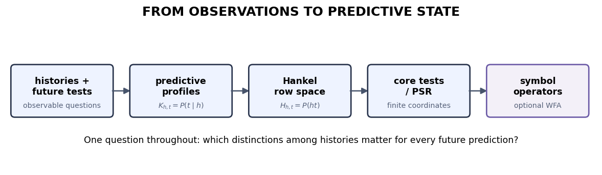

## What exactly did the probe decode?

<h3>HMM belief $b(h)$</h3>

A posterior over the hidden states of a <strong>chosen realization</strong>.

Useful and sufficient for that realization's future predictions.

<h3>Observable predictive state</h3>

Whatever distinctions between histories change the distribution over future observations.

No hidden-state labels required.

What survives if we change the hidden realization but keep every observable word probability fixed?

::: {.notes}
- Target: about 2 minutes.
- This is not an attack on HMM beliefs; it changes which object is primitive.
- Use “sufficient relative to the chosen realization,” not automatically minimal for the observable process.
:::

## Histories ask; future tests answer

$$
H_{u,v}=\Pr(uv)
$$

<table class="comparison-table" aria-label="Generic Hankel matrix with histories as rows and future tests as columns">
<thead><tr><th>history $u$ ↓ / future test $v$ →</th><th>$\epsilon$</th><th>$0$</th><th>$1$</th><th>$00$</th><th>$\cdots$</th></tr></thead>
<tbody>
<tr><td>$\epsilon$</td><td>$\Pr(\epsilon)$</td><td>$\Pr(0)$</td><td>$\Pr(1)$</td><td>$\Pr(00)$</td><td>$\cdots$</td></tr>
<tr><td>$0$</td><td>$\Pr(0)$</td><td>$\Pr(00)$</td><td>$\Pr(01)$</td><td>$\Pr(000)$</td><td>$\cdots$</td></tr>
<tr><td>$1$</td><td>$\Pr(1)$</td><td>$\Pr(10)$</td><td>$\Pr(11)$</td><td>$\Pr(100)$</td><td>$\cdots$</td></tr>
<tr><td>$\vdots$</td><td>$\vdots$</td><td>$\vdots$</td><td>$\vdots$</td><td>$\vdots$</td><td>$\ddots$</td></tr>
</tbody>
</table>

::: {.notes}
- Target: about 2 minutes.
- Read one entry aloud: history $u$, then test $v$, gives the joint probability of their concatenation.
- This generic grid contains no numbers from the exercise table.
:::

## Likelihood is not yet prediction

<h3>Joint row</h3>
$$H_{u,\cdot}=\bigl(\Pr(uv)\bigr)_v$$

Its scale includes how likely the history itself was.

<h3>Conditional predictive row</h3>
$$K_{u,\cdot}=\bigl(\Pr(v\mid u)\bigr)_v$$

It compares future profiles after conditioning on the history.

Proportional joint rows can encode identical conditional predictions.

::: {.notes}
- Target: about 2 minutes.
- Do not normalize the supplied exercise rows on the slide; students will perform that step.
- Ask what information is discarded when a joint row becomes conditional.
:::

## Predictive equivalence quantifies over every future

Histories $u$ and $u'$ are predictively equivalent when

$$
\Pr(v\mid u)=\Pr(v\mid u')
\qquad\text{for every finite future word }v.
$$

<h3>One token</h3>
A useful probe, but often too weak.

<h3>Displayed suffixes</h3>
Finite evidence for a pattern.

<h3>Every future</h3>
The process-relative equivalence notion.

::: {.notes}
- Target: about 90 seconds.
- Connect back to the Z1R pair: a one-token comparison merged histories that a longer test separated.
- Agreement on a finite worksheet table is never, by itself, full equivalence.
:::

## Finite predictive coordinates are earned, not assumed

  
full future rows

→

  
linear dimension

→

  
selected core tests

→

  
symbol updates

<h3>PSR idea</h3>

Use probabilities of a small set of future tests as coordinates when those tests span the predictive space.

A finite table is evidence, not yet a theorem about the full process; the notebook earns its later claims before selecting core tests.

Theory anchors: <a href="https://proceedings.neurips.cc/paper_files/paper/2001/hash/1e4d36177d71bbb3558e43af9577d70e-Abstract.html">Littman, Sutton &amp; Singh (2001), predictive state representations</a>; <a href="https://doi.org/10.1162/089976600300015411">Jaeger (2000), observable-operator models and finite linear realizations</a>.

::: {.notes}
- Target: about 2 minutes.
- Keep this conceptual. Do not reveal the table's local dependency, its rank, the selected basis, or the adopted continuation.
- “Finite predictive coordinate system” is the payoff; rank is evidence that must be interpreted honestly.
:::

## The notebook starts from observations

Open Notebook 3

Interrogate the finite table, distinguish local evidence from a full claim, normalize before comparing predictions, and only then choose coordinates.

::: {.notes}
- Target: 1–2 minutes, then hand off.
- The WFA box is explicitly optional. The core ends at the observable/HMM factorization.
- Ask students to carry one question through the notebook: how much predictive memory does this process require?
:::
